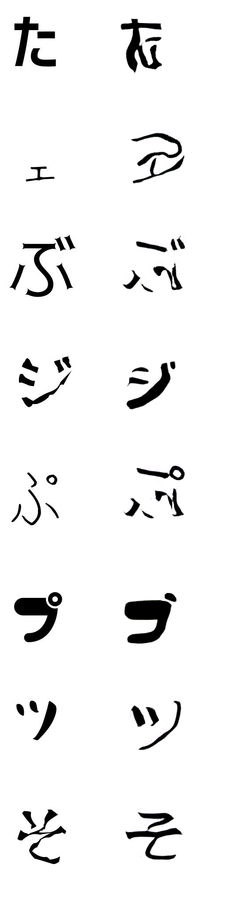
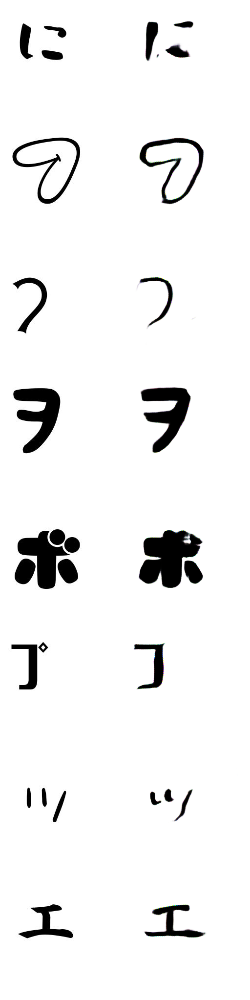
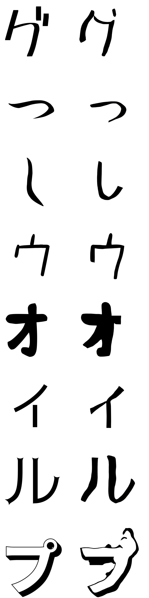
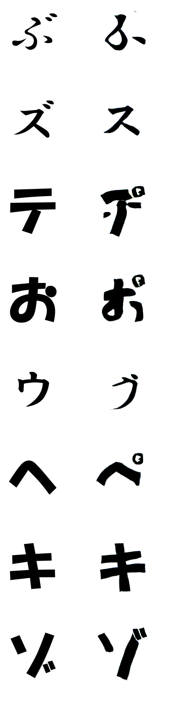

# __Font Generation__

## ◆ Zi2Zi TensorFlow ⇒ Pytorch 変換
[zi2ziのTensorFlowコード](https://github.com/kaonashi-tyc/zi2zi)のファイル名や、引数名、構造などを出来る限り変えないようにしてPyTorchコードへ変換しました。
___
### File名 : __ops.py__
このスクリプトはzi2ziモデルのgeneratorやdiscriminatorを構築するための基本オペレーターを定義します。

TensorFlowコードの
```py
#TensorFlowコード
def batch_norm(・・・):
def conv2d(・・・):
def deconv2d(・・・):
def lrelu(・・・):
def fc(・・・):
def init_embedding(・・・):
def conditional_instance_norm(・・・):
```
は以下のようにクラス化してPyTorchコードに変換しました。
```py
#PyTorchコード
class BatchNorm(nn.Module):
class Conv2d(nn.Module):
class Deconv2d(nn.Module):
class Lrelu(nn.Module):
class FC(nn.Module):
class Embedding(nn.Module):
class ConditionalInstanceNorm(nn.Module):
```

- ___BatchNorm___ Moduleはinput Batch内の要素全体でNormalizationする層です。

- ___Conv2D___ Moduleの変換でTensorFlowでのSAME Padding機能がPyTorchにはないので_nn.ConstantPad2d_を利用しSAME Paddingを実装しました。このModuleはinputを畳みこむ層です。

- ___Deconv2D___ ModuleではTensorFlowと同じkernel size、strideで同じoutput channelを出すため、padding=2、output_padding=1で設定しました。このModuleは畳みこまれたinputを逆にする層です。

- ___Lrelu___ Moduleは勾配消失を防ぐための活性化関数です。

- ___FC___ Moduleは特徴量をすべて連結するFully Connected層です。

- ___Embedding___ Moduleはラベルごと学習できるようにラベル情報を埋め込む機能をします。

- ___ConditionalInstanceNorm___ Moduleはコード変換後、同じrandom inputを渡してTensorFlowとPyTorchでの結果がほぼ同じ値が出ることを確認しました。このModuleはBatch内でラベルごとNormalizationをさせる機能をしますが、実際に学習でこのModuleを使用すると最初ごろは確かにラベルごとNormalizationしていくのが見えますが、zi2ziの [**blog post**](https://kaonashi-tyc.github.io/2017/04/06/zi2zi.html#tried-but-didnt-work)やコードにも書いている通り学習途中でmode collapseが起きることを確認しました。
___
### File名 : __unet.py__
このスクリプトはzi2ziモデルを構築、学習、推論処理を定義します。

モデル構築、学習方法が
TensorFlowは __Define-and-run__ PyTorchは __Define-by-run__ で異なります。
なので、placeholder や　feed dict などの　__Define-and-run__　用のコードは削除しました。

TensorFlowコードの__UNet__ クラスの以下のメソッドは
```py
#TensorFlowコード
def encoder(・・・):
def encode_layer(・・・):
def decoder(・・・):
def decode_layer(・・・):
def generator(・・・):
def discriminator(・・・):
```
以下のようにクラス化してPyTorchコードに変換しました。
```py
#PyTorchコード
class Encoder(nn.Module):
class EncodeLayer(nn.Module):
class Decoder(nn.Module):
class DecodeLayer(nn.Module):
class Generator(nn.Module):
class Discriminator(nn.Module):
```
- ___Encoder___ ModuleはGeneratorモデルでinputをエンコードする役割をします。

- ___EncodeLayer___ Moduleは __Encoder__ を構成するLayerです。quality改善のための検証のため、オプション引数によって　__BatchNorm__、__InstanceNorm__、__ConditionalBatchNorm__ を切り替えてモデル構築するように実装しました。

- ___Decoder___ ModuleはGeneratorモデルでEncodingされたInput(潜在変数)をでコードする役割をします。

- ___DecodeLayer___ Moduleは __Decoder__ を構成するLayerです。既存処理でオプションで __ConditionalInstanceNorm__ を実装できます。quality改善のための検証のため、オプション引数によって __BatchNorm__、__InstanceNorm__、__ConditionalBatchNorm__ を切り替えてモデル構築するように実装しました。

- ___Generator___ モデルを定義します。UNetの構造をしています。inputのソース文字からEncoding、Decodingを行ってoutputのターゲット文字を生成する役割をします。

- ___Discriminator___ モデルを定義します。__Generator__ モデルから生成されたFake文字がRealかFakeかを識別する役割をします。quality改善のための検証のため、オプション引数によって __BatchNorm__、__SpectralNorm__ を切り替えてモデル構築するように実装しました。

#### ※以下はzi2ziモデルを構築、学習、推論を担当する __UNet__ クラスでのTensorFlow→PyTorch変換

TensorFlowコードの以下のメソッドは
```py
#TensorFlowコード
def build_model(・・・):
```
__Define-and-run__ から __Define-by-run__ への変換に合わせて以下のようにメソッドを分けて実装しました。
```py
#PyTorchコード
def forward(・・・):
def d_backward(・・・):
def g_backward(・・・):
```
- ___forward___ ではinputのソース文字(_real\_A_)を __Generator__ モデルに渡してFake文字(_fake\_B_)、エンコーディングされたソース文字(_encoded\_real\_A_)をoutputします。生成されたFake文字(_fake\_B_)をもう一度 __Generator__ モデルの __Encoder__ に渡してエンコーディングされたFake文字(_encoded\_fake\_B_)もoutputします。文字のラベル情報ををOne Hot Vector(_true\_labels_)で作っておきます。

生成されたFake文字は __g\_backward__ でターゲット文字(_real\_B_)と近くなります。

- ___d\_backward___ では __Discriminator__ モデルにターゲット文字(_real\_B_)を渡してからのoutputを1に近くさせるLoss(_d\_loss\_real_)、Fake文字(_fake\_B_)を渡してからのoutputを0に近くさせるLoss(_d\_loss\_fake_)、文字とある文字のラベルが一致させるカテゴリLoss(_category\_loss_)を計算し、学習モードの時、back propagationを行い、__Discriminator__ モデルを最適化します。

- ___g\_backward___ では ___forward___ で取得したエンコーディングされたソース文字(_encoded\_real\_A_)とエンコーディングされたFake文字(_encoded\_fake\_B_)の差を小さくするコンスタントLoss(_const\_loss_)、__Discriminator__ モデルに___forward___ で生成したFake文字(_fake\_B_)を渡してからのoutputを1に近くさせ、__Discriminator__ をだまそうとするLoss(_cheat\_loss_)、Fake文字のカテゴリLoss(_fake\_category\_loss_)、 Fake文字とターゲット文字の差を小さくするLoss(_l1\_loss_)を計算し、学習モードの時、back propagationを行い、__Generator__ モデルを最適化します。

TensorFlowコードの以下のメソッドは
```py
#TensorFlowコード
def retrieve_trainable_vars(・・・):
```
encoderの重みを固定する機能のため以下のようにメソッドを分けて実装しました。
```py
#PyTorchコード
def set_requires_grad(・・・):
def freeze_encoder(・・・):
```

__以下はTensorFlowとPyTorchで同じメソッド名__
```py
def checkpoint(・・・):
def restore_model(・・・):
```
- ___checkpoint___ ではPyTorchモデルを保存します。
- ___restore\_model___ ではPyTorchモデルをロードします。

```py
def validate_model(・・・):
```
- ___validate\_model___ メソッドはPyTorchの __Define-by-run__ で動作するようにコード変換しました。(TensorFlowの _generate\_fake\_samples_ メソッドは削除)　重みを更新せずに、学習させてない文字データについてLossを取得、生成されたFake文字をイメージファイルに保存します。

```py
def export_generator(・・・):
```
- ___export\_generator___ メソッドはPyTorchのモデルロード、保存機能を利用して __Generator__ モデルだけエクスポートする処理で変換しました。(推論のみ行う場合、__Discriminator__ モデルは必要ない)

```py
def infer(・・・):
```
- ___infer___ メソッドはPyTorchの __Define-by-run__ で動作するようにコード変換しました。(TensorFlowの _generate\_fake\_samples_ メソッドは削除)　zi2ziモデルを利用し推論する役割をします。学習されたzi2ziモデルをロードしinputのソース文字をgenerateしたいラベル番号を与えて文字生成、その生成文字のイメージファイルを保存します。

```py
def interpolate(・・・):
```
- ___interpolate___ メソッドは例えば0と1のラベルの文字スタイルでステップを踏んで0の文字スタイルから1の文字スタイルに変化していくイメージを取得する役割をします。文字スタイルが変化していくようにするためにはモデルの中のすべてのembedding Moduleを操作する必要があって、PyTorchで動作するように変換しました。

```py
def train(・・・):
```
- ___train___ メソッドはPyTorchの __Define-by-run__ で動作するようにコード変換しました。zi2ziモデルを学習する役割をします。__Generator__ モデル用、__Discriminator__ モデル用のOptimizerをそれぞれ用意して __Generator__ モデル、__Discriminator__ モデルをそれぞれで最適化するようにします。データセットから学習データを ___forward___　でgenerateして、その後、___d\_backward___　で __Discriminator__ モデル最適化、 ___g\_backward___　で __Generator__ モデル最適化します。それぞれ最適化する際は反対のモデルの重み更新はしないようにするため ___set\_requires\_grad___ メソッドなどで重みを固定する必要がありますが、PyTorchのFrameWorkではOptimizerがモデルごと、分けていたら反対のモデルの重み更新はしないことで重み固定のコードは省きました。zi2ziでは__Generator__ モデルの最適化を1epoch内で2回行います、これで1epochの学習時間が長くなりますが、その分qualityが改善されると思いました。**train.py**で`--flip_labels`のオプション追加でターゲット文字なしモードでは　1回目の　___g\_backward___ で `retain_graph=True`を追加しないと2回目 ___g\_backward___ でエラーになりました。`retain_graph=True`を使うとGPUメモリを多く使用することで`--flip_labels`のオプション追加のみで`retain_graph=True`を指定するように実装しました。

___
### File名 : __export.py__
### File名 : __infer.py__
### File名 : __train.py__

上記のスクリプトはPyTorchでそれぞれ、__unet.py__ の __UNet__ クラスを利用して __Generator__ モデルエクスポート、zi2ziモデル学習、zi2ziモデル推論を行うように変換しました。なお、quality改善検証のためコード追加もしました。
___
___
## ◆PyTorch Zi2Ziのパフォーマンス確認
TensorFlowから変換したpytorch zi2ziを動かすため、環境構築、学習しその結果を確認しました。
___
### **環境構築**

- Windows10、python3.6.5、CUDA10、cuDNN7.6.5、conda環境で動作確認しました。Linux Ubuntu16.04でも動作することを確認しました。

```cmd
conda create -n font_generation python=3.6 anaconda
activate font_generation
pip install torch===1.1.0 torchvision===0.4.0 -f https://download.pytorch.org/whl/cu100/torch_stable.html
pip install scipy==1.1.0 tensorboard==2.1 future
```
___
### **学習データセット作成**
Windowsにデフォルトにある漢字Fontはスタイルがほとんど似ているように見えたのでFree Fontサイトで以下の5つのFontをダウンロードしてターゲットFontとして、Windowsの**msjc**FontをソースFontとして漢字データセットを作成しました。(Fontごと1000サンプリング、Train:4500データ、Val:500データ)
```sh
#dst_font
0  HanyiSentyCrayon
1  MaShanZheng-Regular
2  ZCOOLQingKeHuangYou-Regular
3  benmojinhei
4  benmojunsong

#src_font
msjc
```

ダウンロードしたFontをあるフォルダに置いて既存の[zi2zi](https://github.com/kaonashi-tyc/zi2zi)スクリプトの**font2img.py**、**package.py**を利用してコマンドラインで作成はできますが複数のFontからデータセットを作成する場合、手間がかかることでshell scriptを作成しました。**shell**フォルダの**singlestyle_input_font2package.sh**の中身を自分の環境に合わせて、実行することで一回の実行でデータセットを作るように作成しました。学習フォルダ(ex:experiment) の中にdataフォルダ作成してその中に作成された**train.obj**、**val.obj** データセットファイルを置きます。
___
### **学習・推論実行**
学習と推論はTensorFlowのzi2ziのオプションそのままで使えるようにしたので下記のように実行します。

- 学習
```cmd
python train.py --experiment_dir experiment 
                --experiment_id 0
                --batch_size 8 
                --lr 0.001
                --epoch 200 
                --sample_steps 50 
                --schedule 20 
                --L1_penalty 100 
                --Lconst_penalty 15
```
- 推論 - 指定ラベルスタイルの文字を生成しイメージファイルで保存
```cmd
python infer.py --model_dir　checkpoint_dir/ 
                --batch_size　8 
                --source_obj　binary_obj_path 
                --embedding_ids　label[s] of the font, separate by comma
                --save_dir　save_dir/
```
- 推論 - 生成する文字のスタイルがラベル間で変化していくアニメーションファイル作成
```cmd
python infer.py --model_dir　checkpoint_dir/ 
                --batch_size　5
                --source_obj　obj_path 
                --embedding_ids　label[s] of the font, separate by comma
                --save_dir　frames/ 
                --output_gif　gif_path 
                --interpolate　1 
                --steps 5
                --uroboros 1
```
___
### **学習結果**
PyTorchのzi2ziで学習した結果は以下のようにTensorFlowの結果とほぼ同じ結果が得られました。他の文字より小さい、薄い文字のスタイルが少しだけ精度の改善が必要とは見えましたが、漢字の学習ではほとんどうまくターゲットスタイル文字に生成できました。

#### PyTorch zi2zi 200epoch Chinese character Generate Result
<p align="center">

</p>

#### TensorFlow zi2zi 200epoch Chinese character Generate Result
<p align="center">

</p>

### **日本語(ひらがな、カタカナ)での結果**
ここで学習させてない、日本語のひらがな、カタカナ文字を推論させるとどうなるか確認しました。

#### PyTorch zi2zi 200epoch Japanese character(not train) Generate Result (5Labels)
<p align="center">

</p>

この結果を見ると学習させてない日本語かな文字にも漢字Fontのスタイルで文字が生成されることが確認できます。漢字には画数が多く文字の特徴量が多い、かつ文字のデータ種類も多いのでこれで学習したFontのスタイルが漢字と比べ、特徴量が少ない、シンプルな日本語かな文字にも表現できたと思います。この方法を利用するといろんな漢字Fontからそのスタイルの日本語Fontを簡単に作ることができると思います。しかし、生成された日本語かな文字を見るとまだ、不完全で生成された文字もあるし、濁点「゛」と半濁点「゜」もうまく表示できないなどまだ、課題(TensorFlow zi2ziも同じ結果)があるように見えます。

次は、日本語ひらがな、カタカナの文字だけを学習させて結果を確認してみました。
___
___
## ◆日本語(ひらがな、カタカナ)学習・確認
### **日本語(ひらがな、カタカナ)学習データセット作成**
日本語ひらがな、カタカナの文字だけだとFont一つで160個ぐらいで少ないので学習が早く終わるので23ラベルに増やして(3500データ程度)学習しました。データセットは以下のFree FontサイトでのFont20個とWindowsのFont3個をターゲットFontとしてWindowsの**BIZ-UDGothicR** Fontをソースフォントとして利用して作成しました。日本語のひらがな、カタカナのみ(通常使用する文字を選択)リストを **charset**フォルダの**cjk.son**ファイルに追加、**font2img.py**で `--charset JP_KANA` オプション追加で日本語かなのデータセットを作成できるようにしました。**singlestyle_input_font2package.sh**の中身を修正し、手間かけず簡単にデータセットを作成しました。
```sh
#dst_font
0  HGRGY
1  HGRMB
2  HGRPP1
3  Shirokuma-Regular
4  851H-kktt_004
5  851MkPOP_002
6  AmeChanPopMaruTTFLight-Regular
7  Cinderella
8  g_comichorrorR_freeR
9  GenEi-P-Heavy_ver8
10 GN-Kin-iro_SansSerif
11 gomarice_mukasi_mukasi
12 karakaze-M
13 komorebi-gothic
14 logotypejp_mp_m_1.1
15 Maromin-Regular
16 mogihaPen
17 Origami-Regular
18 PANKIJI_KANA-Line
19 pupupu-free
20 shiasatte
21 togalite-regular
22 uni

#src_font
BIZ-UDGothicR
```
___
### **学習結果**

#### PyTorch zi2zi 200epoch Japanese character(trained) Generate Result (23Labels)
<p align="center">

</p>

学習過程見るとソース文字と似ている文字スタイルほど学習が早い、似ていない文字スタイルほど学習が長くなる傾向がありました。推論結果を見るとほとんどターゲットスタイルに合わせて文字を生成はしましたが、以下のように完全に生成できない場合(ラベル12番)もありました。ラベル12のFontは筆記体で文字が小さいこと、普通の文字と比べ、特徴を取りずらいのが生成しにくい理由に関与していると思いました。

##### 奇数列：ターゲット文字、偶数列：生成文字
<p align="center">

</p>

以下の15のラベルもうまく生成できませんした。一般の文字とのかなり差があるスタイルで生成しにくいと思いました。
##### 奇数列：ターゲット文字、偶数列：生成文字
<p align="center">

</p>

以下の18のラベルも拡大してみるとqualityがそこまでよくないことがわかりました。
##### 奇数列：ターゲット文字、偶数列：生成文字
<p align="center">

</p>

漢字の学習では学習がうまくできて改善するところがよくわかりませんでしたが、日本語の学習でこれらの問題点があったので改善のため検証を行いました。

___
___
## ◆Quality改善検証
途中から気づきましたが、ラベル15のFontはカタカナのスタイルは含んでないFontだったこともあって、今回検証では除外しました。学習で `--ignore_label 12` のオプション追加でデータセットで指定ラベルを除外して学習するようにしました。

___
### **①Normalizaiton Moduleの工夫**
zi2zi __Generator__ モデルは　_Batch Normailzation_ Moduleを使用していて以下のように学習途中のバッチでのターゲット文字と生成文字をみるとあるスタイルの特徴を他のスタイルにも影響を与えながら学習していきます。
##### 奇数列：ターゲット文字、偶数列：生成文字
<p align="center">


</p>

この処理をなんとか、ラベルごとでNormalizaitonできれば生成文字のQualityが上がるのではないかと思いました。zi2zi既存の __ConditionalInstanceNorm__ 処理がまさにこの処理を行いますが、学習途中、mode collapseが起きてしまい(PyTorch,TensorFlow両方)、学習できませんでした。他の方法の工夫で **ops.py** スクリプトに下記のNormalizaiton Moduleを追加しました。

```py
#PyTorchコード
class InstanceNorm(nn.Module):
class ConditionalBatchNorm(nn.Module):
class SpectralNorm(nn.Module):
```
__ConditionalBatchNorm__ と __SpectralNorm__ は[BigGAN](https://github.com/ajbrock/BigGAN-PyTorch/blob/master/TFHub/biggan_v1.py)のコードを利用しました。

- ___InstanceNorm___ Moduleはinput Batch内の要素個別でNormalizationする層です。学習でbatch sizeが1の場合、__BatchNorm__ だとエラーになるので強制で __InstanceNorm__ を使うように実装しました。

- ___ConditionalBatchNorm___ Moduleは __ConditionalInstanceNorm__ と同じ役割でBatch内でラベルごとNormalizationさせるように機能します。__ConditionalInstanceNorm__ は __Generator__ の __Decoder__ のみで実装されていますが、このModuleは __Encoder__、__Decoder__ 両方に実装し、quality改善検証を行いました。

- ___SpectralNorm___ Moduleは係数行列の特異値分解を使ったNormalizationする層です。
___
#### Instance Normalization の確認
学習で `--g_norm_type in` のオプション追加で __Generator__ モデルで　__BatchNorm__　の代わりに　__InstanceNorm__ を使用して学習します。　以前のGANの研究から　_Batch Normailzation_　を使うことでQualityが改善されたことだったのであまり期待せず確認しました。その結果は以下のように**よくない結果**になりました。
##### 奇数列：ターゲット文字、偶数列：生成文字
<p align="center">



</p>

___
#### Conditional Batch Normalization の確認
学習で `--g_norm_type cbn` のオプション追加で __Generator__ モデルで　__BatchNorm__　の代わりに　__ConditionalBatchNorm__ を使用して学習します。このNormalizaiton Moduleを使用することでBatch内でラベルごとNormalizaitonすることが確認できましたし、__ConditionalInstanceNorm__ と違ってmode collapseは起きませんでした。 その結果は以下のように以前より**いい結果**になりました。
##### 奇数列：ターゲット文字、偶数列：生成文字
<p align="center">


</p>

___
#### Spectral Normalization の確認
学習で `--d_norm_type sn` のオプション追加で __Discriminator__ モデルで　__BatchNorm__　の代わりに　__SpectralNorm__ を使用して学習します。__Discriminator__ モデルの __BatchNorm__ の代わりに置き換えるだけで、GANが安定化、パフォーマンスもよくなるとのことで検証してみました。その結果は以下のように**いい結果**になりました。
##### 奇数列：ターゲット文字、偶数列：生成文字
<p align="center">



</p>

___
#### Conditional Batch Normalization + Spectral Normalization の確認
Normalizaiton Moduleの検証で __Generator__ モデルでは __ConditionalBatchNorm__ を使用、__Discriminator__ モデルでは __SpectralNorm__ を使用することで結果が良かったので学習で `--g_norm_type cbn --d_norm_type sn` のオプション追加で組み合わせて検証してみました。その結果は以下のように**一番いい結果**になりました。

##### PyTorch zi2zi 200epoch Japanese character(trained) Generate Result (22Labels)
<p align="center">

</p>

ラベル12についても以下のようにGenerate出来ていることが確認できました。
##### 奇数列：ターゲット文字、偶数列：生成文字

</p>

ラベル18についても以下のように以前よりqualityが改善されました。
##### 奇数列：ターゲット文字、偶数列：生成文字
<p align="center">

</p>

___
### **②Rotate Augmentation追加**
**dataset.py** を見るとData Augmentation処理で回転についての処理は書いてなかったので追加して確認してみました。`--rotate_range 40`のオプション追加で学習することで [-40,40]の範囲でランダムにソース文字、ターゲット文字を回転するように実装しました。検証で0,1,2のラベルだけで学習を行いました。その結果は以下になります。

#### Rotate Augmentation ON Train Generate Result (3Labels)
<p align="center">

</p>

#### Rotate Augmentation OFF Train Generate Result (3Labels)
<p align="center">

</p>

結果を見るとRotate Augmentation処理を入れて学習をすることで回転された文字についてよりqualityよい文字が生成されるのが確認できます。Rotate Augmentationは学習してない文字についてもqualityよく文字を生成するため、**有効**だと思います。
___
### **③CycleGAN手法適用**
[CycleGAN github](https://github.com/junyanz/pytorch-CycleGAN-and-pix2pix)や[YouTube](https://www.youtube.com/watch?v=Fkqf3dS9Cqw)を参考してCycleGANで生成物のqualityが改善されるとの説明があったので、zi2ziにも適用してみました。モデルの構造は変更せず、CycleGANの基本概念を入れました。 **逆Generetor**モデル(c_generator) 、**逆Discriminator**(c_discriminator)モデル を用意して ソース文字を __Generator__ モデルに通して取得する生成文字を再び**逆Generetor**モデルに通して生成される文字がソース文字との差が少なくなるようにLossを計算するように実装しました。そのほかにも __Generator__ モデルと __Discriminator__ モデルでのLoss計算を**逆Generetor**モデル、**逆Discriminator**モデルでの処理でも同じく計算するようにして最適化するように実装しました。CycleGANでGAN lossで利用する**LSGAN**も使用できるように実装しました。

まず、`--gan_loss_type lsgan` のオプション追加で**LSGAN**利用の学習を確認すると学習がうまくいかなかった(文字が生成されない)ので、通常のLossに戻して進めました。`--cycle_gan` のオプション追加でCycleGAN学習を行うと、0,1,2の少ないラベルでは以下のように学習していくことは確認できました。
##### 奇数列：ターゲット文字、偶数列：生成文字
<p align="center">


</p>

しかし、20ラベル以上で学習させると文字が生成されず、**学習がうまくいきませんでした。** Loss曲線は減っていたので長時間学習させると文字が生成されるかもしれないと思いました。あと、zi2ziはCycleGANと違ってCategory学習をしていること、CycleGANは高解像度画像の学習のため、**Generator** モデルのencoder、decoderをresnetで利用していることなど違うところがあるので、うまく学習させるためには厳密に検証が必要だと思います。
___
### **④512サイズの学習データでの学習**
イメージ学習で解像度を高くして学習することで精度が上がる場合があります。それでデフォルト256のサイズの2倍の512サイズのでの学習でquailtiの改善ができるかを検証しました。512サイズのinputにも対応させるため(TensorFlow zi2ziも512サイズinputは対応していませんでした。) __Generator__ モデルの __Encoder__ 、__Decoder__ に __Conv2D__ Moduleを追加した以下のEncoder、Decoderクラスを追加しました。
```py
#PyTorchコード
class Encoder512(nn.Module):
class Decoder512(nn.Module):
```
512サイズデータセットは、**singlestyle_input_font2package.sh**の中身の**font2img.py**の実行で `--canvas_size 512 --char_size 400` のオプション追加で手間かけず簡単に作成しました。
このデータセットを利用し、**train.py**の実行で`--image_size 512`のオプション追加で学習を起こった結果は以下になります。
##### 奇数列：ターゲット文字、偶数列：生成文字
<p align="center">




</p>

結果では512サイズinput学習で生成文字の**quailty改善はできませんでした。** 今回、512サイズで学習させるため、単純にoutputのshapeを合わせるため、Convolution Layerを追加しましたが、CycleGANでの情報でzi2ziのUNetは高解像度対応では適してなく、resnetに変えたとの話もありまして、512サイズを高解像度といえるか微妙ですが、高解像度対応のため、__Generator__ モデルの構造を見直す必要があるかもしれないと思いました。

___
### **⑤複数スタイルのソース文字での学習**
今まで、__Generator__ モデルにInputされるデータは単一のFontのみ、ソース「1」対ターゲット「多」で学習していました。学習させたソース文字と似ている、例えばラベル2をソース文字として推論を行うと以下のようにソース文字の特徴も含めて文字生成ができますが、
<p align="center">

</p>
特徴が分かりづらい、例えばラベル12のような文字をソース文字として推論させるとうまく文字が生成できませんでした。
<p align="center">

</p>
これは漢字と違って、日本語の文字は数が少ない、特徴量も少ないからだと思います。

ここで複数のスタイルのソース文字でソース「多」対ターゲット「多」の学習で改善できるのではないかと思いました。なお、データ拡張の面でもqualityが改善されるのではないかと思い、複数のスタイルのソース文字での学習を確認しました。まず、**shell** フォルダ内の**multistyle_input_font2package.sh**のスクリプトを利用して複数スタイルのソース文字対応データセットを作りました。作った結果データは90000個ぐらいになりました。これで一旦、検証で0,1,2のラベルで学習を実行し、以下のように学習していくことを確認しました。
##### 奇数列：ターゲット文字、偶数列：生成文字
<p align="center">



</p>

ソース文字が多いので学習に時間がかかるのもありますが、結構時間(1日程度)が経っても生成文字のqualityはあまり改善されませんでした。22ラベルの学習ではデータ数が多すぎるので1日15epochぐらい回せる学習になりました。実際の学習では以下のように学習していたが、8epochぐらいで  **mode collapseが起きて学習できませんでした。**
##### 奇数列：ターゲット文字、偶数列：生成文字
<p align="center">


</p>

### **⑥その他Quality改善への取り組み**
- tensorflow zi2ziの既存機能である程度学習ができたモデルでqualityをさらに改善させるため、(例えばラベル17のquality改善)`--freeze_encoder 1 --fine_tune 17`のオプション追加で__Generator__ モデルの __Encoder__ の重みを固定させてから 指定ラベルの文字をFine Tuningさせることで生成文字のqualityが改善できることを確認しました。以下はラベル17でのFineTuning結果です。
##### 奇数列：ターゲット文字、偶数列：生成文字

##### Before Fine Tuning
<p align="center">

</p>

##### After Fine Tuning
<p align="center">

</p>

- zi2ziの [**blog post**](https://kaonashi-tyc.github.io/2017/04/06/zi2zi.html#experiment-details) にも書いている通り、Fine Tuningで`--L1_penalty 500 --Lconst_penalty 1000`のオプション追加で学習が難しい文字についても改善できることを確認しました。
- tensorflow zi2ziの既存機能である**ターゲット文字なしモード**(`--flip_labels`のオプション追加)での効果はあまりわかりませんでした。

上のFineTuningで他のラベルのqualityにも少しづつ影響していくのが見えたので、FineTuningする際は全体のquality を確認しながら進める必要があると思います。

___
___

## ◆結論
Quality改善のため、色々な方法で検証してみた結果、__Generator__ モデルの Normalizaiton Module は **Conditional Batch Normalization** を使用 __Discriminator__ モデルの Normalizaiton Module は **Spectral Normalization** を使用、**Rotate Augmentation**を追加して学習することでQualityが改善されることがわかりました。
なお、学習をうまくさせるためにはソース文字、ターゲット文字両方の特徴が分かりやすい文字で学習させることが大事だと思います。

Quality改善のため、様々な角度から日本語かな文字を使って学習してみました。日本語かな文字の学習でどんな活用ができるか考えてみました。学習したソース文字については、うまく指定したスタイルの文字が生成できるので、ある画像で学習したソース文字があり、その文字を変えて表示したい場合はこの学習モデルが活用できると思います。なお、ソース文字と似ている文字であれば、その文字のinputでその文字の特徴も含めて指定したスタイルの文字が生成されるので、ターゲット文字として学習させたスタイルと少し違うスタイルの文字を生成させる時、活用できるとと思います。ですが、新たな日本語かな文字をGenerate したい場合は、特徴が多い漢字の学習してから日本語かな文字をGenerateするのが一番qualityが高くなると思います。

ここで日本語で学習させたモデルに特徴が多い漢字をinputしたらどうなるか確認してみました。
<p align="center">

</p>

当然な結果だと思いますが、うまくGenerateできないケースが多いです。
逆に特徴がすくない英語アルファベットをGenerateしたらどうなるか見てみました。英語アルファベットのソースデータセットは英語アルファベットリストを **charset**フォルダの**cjk.son**ファイルに追加、**font2img.py**で `--charset EN` オプション追加で作成できるようにしました。

<p align="center">

</p>

結果を見ると漢字のGenerateと比べうまくGenerateできました。日本語よりシンプルな文字生成に使えると思います。日本語の文字は漢字と比べ文字が少ないので学習も早く終わることもメリットだと思います。なお、特徴が分かりやすいひらがな、あるいはカタカナのみあるFontについては、それぞれ学習を通じて片方のかなをGenerateできるのではないかと思いました。（今回、学習させたひらがなのみのラベル15の場合、普通の文字と特徴がかなり違うこともあってカタカナの生成はうまくできませんでした。）

今回、Font Generation の取り組みを行って、GAN、そしてquality改善方法など勉強になりました。今後さらにquality改善を行い、漢字から日本語かな文字をGenerate、日本語かな文字から英語アルファベットを含むよりシンプルな文字をGenerateするなど、AIを利用した色々なスタイルの文字を便利に生成できるようになり、実用化可能だと思います。
___
___

## ◆Acknowledgements
Code derived and rehashed from:

* [zi2zi](https://github.com/kaonashi-tyc/zi2zi) by [kaonashi-tyc](https://github.com/kaonashi-tyc)
* [BigGAN](https://github.com/ajbrock/BigGAN-PyTorch) by [ajbrock](https://github.com/ajbrock)
* [CycleGAN](https://github.com/junyanz/pytorch-CycleGAN-and-pix2pix) by [junyanz](https://github.com/junyanz)

